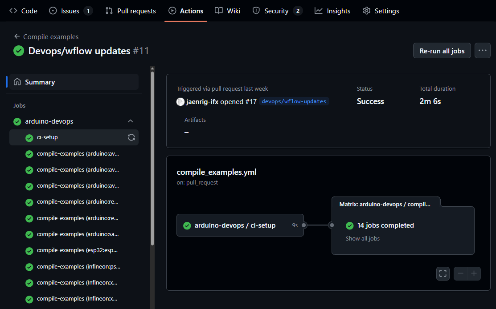

Description
------------

The ``compile-examples`` workflow provides an easy and flexible way to build check a matrix of 
sketches and boards of Arduino cores and libraries. 
It is designed to be used in CI/CD pipelines, with minimal integration in the CI infra workflows.

|

It relies on the Arduino `platform <https://docs.arduino.cc/arduino-cli/platform-specification>`_ and `library <https://docs.arduino.cc/arduino-cli/library-specification/>`_
specifications to auto-discover the available boards and examples available in the asset by default.

The default auto-discovery matrix can be customized to consider exceptions via configuration YAML files.

It also supports the installation of the tools and source dependencies for multiple operating systems, which are necessary for compiling the sketches for the selected boards.

Implementation details
^^^^^^^^^^^^^^^^^^^^^^

From a high level, the GitHub Action workflow implements the following functionality:

#. Get the matrix of **boards** and **operating systems** to compile the examples against.
#. Generate the **package core** (Arduino core only).
#. For each board and operating system combination **a job is created** which:
    
    #. **Install** the required **tools** and asset **dependencies**.
    #. **Compile** the relevant examples for the board sequentially.

Please, explore the `compile-examples.yml <https://github.com/Infineon/arduino-devops/blob/main/.github/workflows/compile-examples.yml>`_ file to find out more about the implementation details of the reusable workflow.