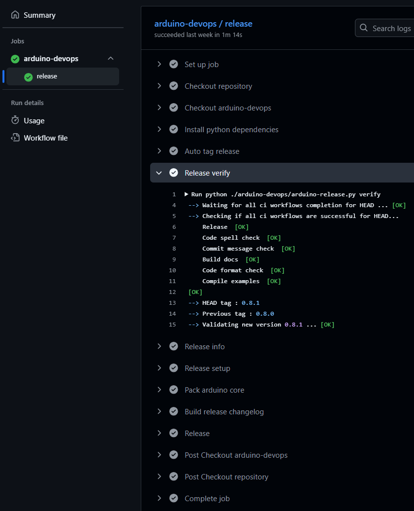

Description
------------

The ``release`` workflow provides an automated and standardized way to create releases for Arduino cores and libraries.
It is designed to be used in CI/CD pipelines, enabling seamless integration with GitHub Actions to automate the entire release process.

|

The workflow integrates with the :doc:`arduino-release.py <../scripts/arduino-release>` script to handle semantic versioning, changelog generation, and GitHub release creation.
It supports both Arduino cores and libraries, automatically detecting the asset type and applying the appropriate release procedures.

The workflow is designed as a reusable GitHub Action that can be called from other repositories, providing a consistent release process across multiple Arduino assets.

Implementation details
^^^^^^^^^^^^^^^^^^^^^^

From a high level, the GitHub Action workflow implements the following functionality:

#. **Validate inputs** and determine the asset type (core or library).
#. **Setup the environment** with required tools and dependencies using the provided setup script.
#. **Execute the release process** using the arduino-release.py script with the specified version.
#. **Create a GitHub release** with automatically generated changelog and release notes.
#. **Upload release assets** including packaged cores or library archives.

The workflow supports:

- **Semantic versioning** with automatic version validation
- **Changelog generation** from commit history and pull request information
- **Multi-platform compatibility** for different operating systems
- **Flexible setup scripts** to accommodate different project requirements
- **Automatic asset packaging** for both cores and libraries

Please explore the `release.yml <https://github.com/Infineon/arduino-devops/blob/main/.github/workflows/release.yml>`_ file to find out more about the implementation details of the reusable workflow.
