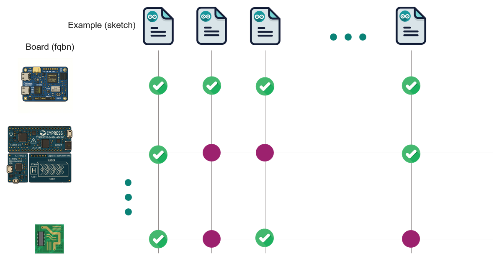

arduino-ci
==========

The main functionality of this script is the configuration and compilation of the sketches and boards matrix. 
Additionally, it supports the installation of the tools and dependencies required for compilation.

|

The tool will auto-discover the list of boards and examples available in the asset to create the matrix. 
In the case of libraries, a default configuration file is provided for listing the boards in ``config``. 

Alternatively, a custom configuration file can be provided to overwrite or complement the default set of boards and sketches in the matrix. 
See the `YAML configuration matrix specification <#yaml-configuration-matrix-specification>`_ section for more details.
If the file is named ``ci-matrix-config.yml``, it will be automatically discovered in the root path of the repository asset. 
Otherwise, you can specify the file by using the flag ``-c``, ``--ci-matrix-yml`` followed by the file path:

.. code:: bash

    python arduino-devops/arduino-ci.py <command> -c path/to/ci-matrix-config.yml

The script needs to know the root path of the asset to be able to discover the boards and examples.
Unless specified, the root path will be the current working directory from which the script is executed.
Otherwise, you will need to specify the root path of the asset by using the flag ``-r``, ``--root-path`` followed by the path to the asset's root directory:

.. code:: bash

    python arduino-devops/arduino-ci.py <command> -r path/to/arduino/asset/root

For the upcoming usage example, we will assume that:
 - You have the ``arduino-devops`` repository cloned in the root path of the Arduino asset.
 - You have a ``ci-matrix-config.yml`` file in the root path of your arduino asset, or that you rely on the auto-discovery of boards and examples based on asset type.

The following commands are available:

config
------

Shows and queries the ci configuration matrix. This command is helpful within CI/CD workflows in the creation of parallel jobs 
for the compilation of the sketches and boards matrix.

It supports the following output formats:

 - JSON (``--json`` or ``--json-pretty``)
 - YAML (``--yaml``) . 

.. code:: bash

    python arduino-devops/arduino-ci.py config --list fqbn --yaml

You can query the "fqbn" and "sketch" keys by the usage of the flags ``--list`` and ``--filter``.

For example, if we want to know which are the matrix board:

.. code:: bash

    python arduino-devops/arduino-ci.py config --list fqbn

Or if we want to know which sketches are included in the matrix:

.. code:: bash

    python arduino-devops/arduino-ci.py config --list sketch

We can use the --filter flag to filter the matrix by a specific board or sketch. For example, if we want to know which sketches are included in the matrix for the Arduino Uno board:

.. code:: bash

    python arduino-devops/arduino-ci.py config --list sketch --filter fqbn=arduino:avr:uno

will list all the sketches to be compiled against the ``arduino:avr:uno`` board. Or 
if we want to know which boards are to be compiled in the matrix for the "blink" example:

.. code:: bash

    python arduino-devops/arduino-ci.py config --list fqbn --filter sketch=examples/blink/blink.ino

Use the help command to see all the available options:

.. code:: bash

    python arduino-devops/arduino-ci.py config --help

compile
-------

This command compiles the different combinations of the sketch - boards matrix.

This will compile for each board all the applicable sketches in the matrix:

.. code:: bash

    python arduino-devops/arduino-ci.py compile

Without additional arguments, it will look for the sketches and boards based on the ``ci-matrix-config.yml`` file if located
in the root path of the repository asset, and/or the auto-discovery of boards and examples based on asset type.

We can only compile a specific sketch by using the ``--sketch`` for all the relevant boards:

.. code:: bash

    python arduino-devops/arduino-ci.py compile --sketch examples/blink/blink.ino

Or we can compile all the relevant sketches for a given board by using the ``--fqbn`` flag followed by the FQBN of the board:

.. code:: bash

    python arduino-devops/arduino-ci.py compile --fqbn arduino:avr:uno

core-install
------------

To compile the matrix for Arduino libraries, you must first install the package cores for each board in the matrix.

The following command will take care of the installation of all the required package cores:

.. code:: bash

    python arduino-devops/arduino-ci.py core-install

If only the core for one specific board is required, you can specify it by using the ``--fqbn`` flag:

.. code:: bash

    python arduino-devops/arduino-ci.py core-install --fqbn arduino:avr:uno

lib-deps-install
----------------

If your Arduino asset is a library, it might depends on other Arduino libraries to work.
These are listed in the ``library.properties`` file (``depends=`` field) of the library, and can be installed by using the following command:

.. code:: bash

    python arduino-devops/arduino-ci.py lib-deps-install

.. warning::
    
    This tool only supports constraints which explicitly provide a version.
    Meaning those containing an (at least) equal: >=, <=, =.
    Constraints requiring the discovery of greater, lower or range versions are not (currently) supported.

    Check the version constraints formats allowed in ``library.properties`` file:
    https://docs.arduino.cc/arduino-cli/library-specification/#version-constraints

.. _yaml_config_matrix_specification:

YAML configuration matrix specification
---------------------------------------

The yaml file uses the following keys:

    - sketch: 
        List of sketches to be compiled.

        This key is optional. 
        If not present the sketches will be discovered in the sketch default paths. Those are:

            - For cores: ``/libraries``
            - For libraries: ``/examples``

        Format:    
            - directory path which contains sketches. The path should be relative to the asset root path.
            - .ino sketch path. The path should be relative to the asset root path.
           
        Example:    
            .. code:: yaml

                sketch:
                  - SPI/examples/
                  - examples/some_example/some_example.ino

    - fqbn: 
        List of boards with format <vendor>:<arch>:<board> against which
        the ``sketch`` list will be compiled.

        This key is optional.
        If not present the ``fqbn`` values will:

            - For cores, it will be discovered in the ``boards.txt`` file.
            - For libraries, it will use the defined in the default ``config/ci-config-matrix-ifx-lib.yml`` provided in this repository.
        
        Format:
           - <vendor>:<arch>:<board>

        Example:
            .. code:: yaml

                fqbn:
                  - arduino:avr:uno
                  - esp32:esp32:esp32feather

    - include:
        List of dictionaries with key-value pairs which extend the 
        compile fqbn-sketch matrix. 
        
        This key is optional. 
        Each dictionary of the list can be a list of key-values pairs, 
        or a single key-value pair.
        Each modify the default matrix in a different way:

            - Pair of keys: 
                A dictionary with a ``fqbn`` and ``sketch`` key. Those 
                combinations of fqbn-sketch (if not already present) will also be
                added to the default matrix. 

            - Single keys: 
                A dictionary with either ``fqbn`` or ``sketch`` key. The
                values will then simply extend the default matrix key. 
                This is mainly useful when the main matrix is automatically discovered, 
                and these particular values are "not discoverable".

        The allowed keys are ``fqbn`` and ``sketch``. 
        The value formats allowed are the same as the root `node <https://yaml.org/spec/1.2.2/#nodes>`_ keys (``fqbn`` and ``sketch`` as primary keys in the YAML file). 
        But in this case, the value can be a list (of scalars) or a scalar.

        Example:
            .. code:: yaml

                include:
                  # Example of pair of keys to add sketches which 
                  # should only be compiled for a specific board
                  - fqbn: vendor:avr:board   # The value of this key can be a scalar or list
                    sketch:                  # The value of this key can be a scalar or list
                      - additional_sketch/additional_sketch.ino
                      - extra_example/extra_example.ino
                  # A sketch which should be compiled for all the boards
                  # and not discoverable in the default paths
                  - sketch: some_hidden_path_sketch/some_hidden_path_sketch.ino

    - exclude:
        List of dictionaries with key-value pairs which will be excluded from the
        default fqbn-sketch matrix.

        This key is optional.
        Each dictionary of the list can be a list of key-values pairs, 
        or a single key-value pair.
        Each modify the default matrix in a different way:

        - Pair of keys: 
            A dictionary with a ``fqbn`` and ``sketch`` key. Those combinations of fqbn-sketch (if present) will be removed from the default matrix. 

        - Single keys: 
            A dictionary with either ``fqbn`` or ``sketch`` key. The
            values will be (if present) removed from the default matrix key. 
            This is mainly useful when the main matrix is automatically discovered, 
            and a particular value is not compatible for some reason.

        The allowed keys are ``fqbn`` and ``sketch``. 
        The value formats allowed are the same as the root `node <https://yaml.org/spec/1.2.2/#nodes>`_ keys (``fqbn`` and ``sketch`` as primary keys in the YAML file). 
        But in this case, the value can be a list (of scalars) or a scalar.

        Example:
            .. code:: yaml

                exclude:
                  # Example of pair of keys to remove sketches which 
                  # not applicable for a specific board
                  - fqbn: vendor:avr:board    # The value of this key can be a scalar or list
                    sketch:                   # The value of this key can be a scalar or list
                      - SPI/examples/SPI_mode_not_available_for_this_board.ino
                      - SPI/examples/SPI_mode2_not_available_for_this_board.ino
                  # A sketch which should not be compiled for all the boards
                  - sketch: I2C/examples/i2c_example_with_bug/i2c_example_with_bug.ino

    - asset_type:
        The type of the Arduino asset. 
        The allowed values are ``library`` and ``core``. 

        This key is optional. 
        If not present, the asset type will be discovered based on the existence of 
        files required by the Arduino library or platform specifications.

            - For library: ``library.properties`` file 
            - For core: ``platform.txt`` and ``board.txt`` files and ``cores`` and ``variants`` directories.
    
        Example:
            .. code:: yaml
                
                asset_type: library

    - additional_urls:
        List of dictionaries with key-value pairs with the the keys ``core`` and ``url``.
        This key is optional if no third-party cores are required to be installed with this tool.
        The ``core`` key is the name of the core to be installed, with format <vendor>:<arch>.
        The ``url`` key is the url pointing to the package index json file required by Arduino 
        to install third-party cores.

        Example:
            .. code:: yaml

                additional_urls:
                  - core: esp32:esp32
                    url: https://raw.githubusercontent.com/espressif/arduino-esp32/gh-pages/package_esp32_index.json